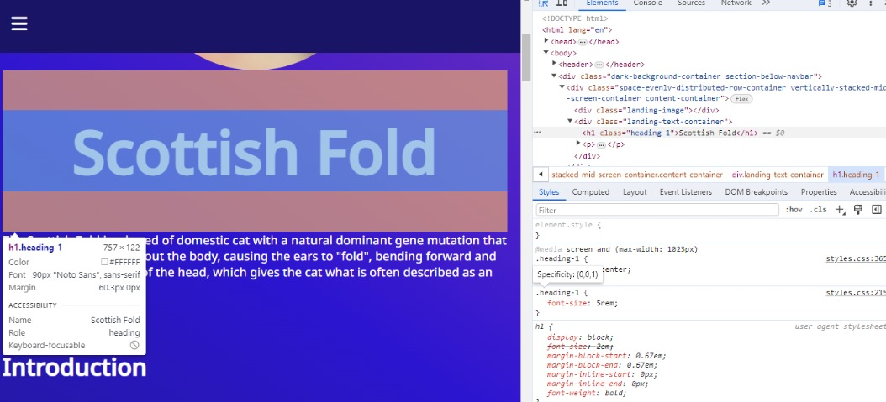
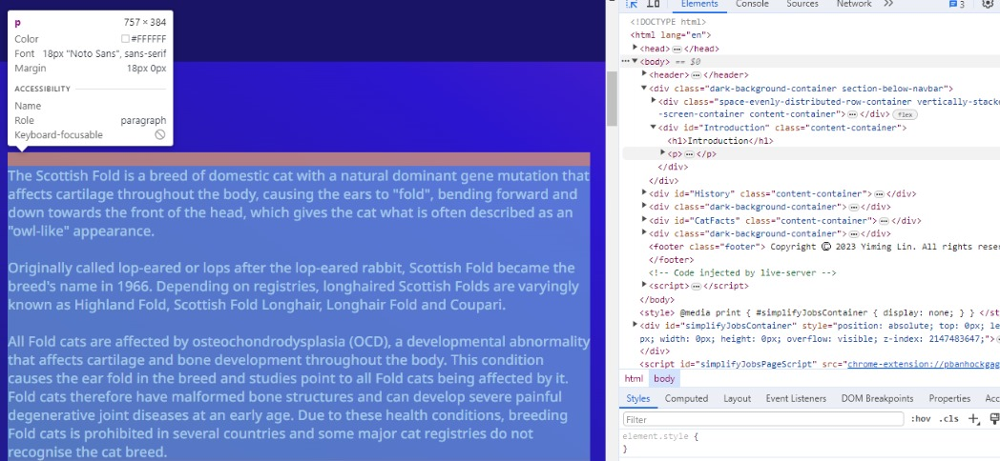
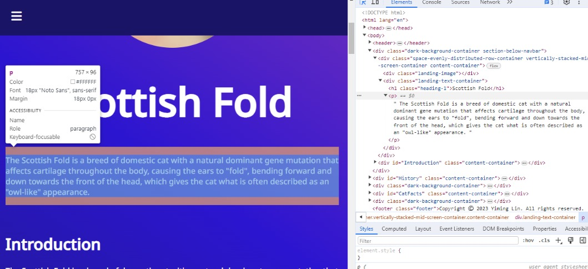

## Code Review Exercise

### Issue #1: Code Refactoring

In the existing code, we're binding event listeners to each individual button having the classes .more-info-button and .close-popup-button. Instead of attaching listeners to each button separately, we can bind a single listener to a stable parent element (like a container present from the page's outset and not generated dynamically). Within this listener, we check if the event target corresponds to the type of element we're concerned with (such as a button with specific classes). If it does, we execute the appropriate code.

Initial code:

```js
const moreInfoButtons = document.querySelectorAll(".more-info-button");

for (const moreInfoButton of moreInfoButtons) {
  moreInfoButton.addEventListener("click", (event) => {
    const popupSection = event.currentTarget.parentElement.nextElementSibling;
    popupSection.style.display = "block";
  });
}

const closePopupButtons = document.querySelectorAll(".close-popup-button");

for (const closePopupButton of closePopupButtons) {
  closePopupButton.addEventListener("click", (event) => {
    console.log(event.target);
    const popupSection =
      event.currentTarget.parentElement.parentElement.parentElement;
    popupSection.style.display = "none";
  });
}
```


Updated code:

```js
const container = document.querySelector(".container-class"); // Replace with the actual container class or ID

container.addEventListener("click", (event) => {
  // Check if the clicked element is a "More Info" button
  if (event.target.matches(".more-info-button")) {
    const popupSection = event.target.parentElement.nextElementSibling;
    popupSection.style.display = "block";
  }

  // Check if the clicked element is a "Close Popup" button
  if (event.target.matches(".close-popup-button")) {
    console.log(event.target);
    const popupSection = event.target.parentElement.parentElement.parentElement;
    popupSection.style.display = "none";
  }
});
```

### Issue #2: Code Refactoring

Instead of using parentElement.parentElement.parentElement, we can use closest('.popup-section').

Initial code:

```js
for (const closePopupButton of closePopupButtons) {
  closePopupButton.addEventListener("click", (event) => {
    console.log(event.target);
    const popupSection = event.currentTarget.parentElement.parentElement.parentElement;
    popupSection.style.display = "none";
  });
}
```


Updated code:

```js
const container = document.querySelector(".container-class"); // Replace with the actual container class or ID

container.addEventListener("click", (event) => {
  // Check if the clicked element is a "More Info" button
  if (event.target.matches(".more-info-button")) {
    const popupSection = event.target.parentElement.nextElementSibling;
    popupSection.style.display = "block";
  }

  // Check if the clicked element is a "Close Popup" button
  if (event.target.matches(".close-popup-button")) {
    console.log(event.target);
    const popupSection = event.target.closest('.popup-section');
    popupSection.style.display = "none";
  }
});
```


### Issue #3: Accessibility

The accessibility concern arises from the absence of the aria-label attribute within the <nav> elements. Incorporating aria-label="Main Navigation" into navbars is crucial for accessibility as it furnishes a descriptive label for screen readers, aiding users in understanding the purpose of the navigation menu.

Initial code:

```html
<nav class="navbar large-screen-navbar">
    <ul class="nav-list">
        <li class="nav-list-item">
        .
        .
        .
</nav>
<nav class="navbar small-screen-navbar">
    <input
        type="checkbox"
        class="navbar-toggle-trigger"
        id="navbar-toggle-trigger"
    />
    .
    .
    .
</nav>
```

Updated code:

```html
<nav class="navbar large-screen-navbar" role="navigation" aria-label="Main Navigation">
    <ul class="nav-list">
        <li class="nav-list-item">
        .
        .
        .
</nav>
<nav class="navbar small-screen-navbar" role="navigation" aria-label="Main Navigation">
    <input
        type="checkbox"
        class="navbar-toggle-trigger"
        id="navbar-toggle-trigger"
    />
    .
    .
    .
</nav>
```


### Issue #5: Accessibility


The accessibility concern arises from the absence of the role attribute within the <nav> elements. Incorporating role="navigation" is crucial for accessibility as it assists assistive technologies like screen readers in comprehending the function of the <nav> element.

Initial code:

```html
<nav class="navbar large-screen-navbar">
    <ul class="nav-list">
        <li class="nav-list-item">
        .
        .
        .
</nav>
<nav class="navbar small-screen-navbar">
    <input
        type="checkbox"
        class="navbar-toggle-trigger"
        id="navbar-toggle-trigger"
    />
    .
    .
    .
</nav>
```

Updated code:

```html
<nav class="navbar large-screen-navbar" role="navigation">
    <ul class="nav-list">
        <li class="nav-list-item">
        .
        .
        .
</nav>
<nav class="navbar small-screen-navbar" role="navigation">
    <input
        type="checkbox"
        class="navbar-toggle-trigger"
        id="navbar-toggle-trigger"
    />
    .
    .
    .
</nav>
```


### Issue #6: Accessibility

The accessibility concern lies in the absence of the role attribute within the <a> elements. Employing role="menuitem" for anchors within the provided context signifies that they are menu items, enhancing both semantics and accessibility.

Initial code:

```html
<nav class="navbar large-screen-navbar">
  <ul class="nav-list">
    <li class="nav-list-item">
      <a href="#Introduction" class="nav-link hover-transition">Introduction</a>
    </li>
    <li class="nav-list-item">
      <a href="#History" class="nav-link hover-transition">History</a>
    </li>
    <li class="nav-list-item">
      <a href="#Characteristics" class="nav-link hover-transition"
        >Characteristics</a
      >
    </li>
    <li class="nav-list-item">
      <a href="#CatFacts" class="nav-link hover-transition">Cat Facts</a>
    </li>
    <li class="nav-list-item">
      <a href="#RequestInfo" class="nav-link hover-transition">Request Info</a>
    </li>
  </ul>
</nav>
```

Updated code:

```html
<nav class="navbar large-screen-navbar">
  <ul class="nav-list">
    <li class="nav-list-item">
      <a href="#Introduction" class="nav-link hover-transition" role="menuitem"
        >Introduction</a
      >
    </li>
    <li class="nav-list-item">
      <a href="#History" class="nav-link hover-transition" role="menuitem"
        >History</a
      >
    </li>
    <li class="nav-list-item">
      <a
        href="#Characteristics"
        class="nav-link hover-transition"
        role="menuitem"
        >Characteristics</a
      >
    </li>
    <li class="nav-list-item">
      <a href="#CatFacts" class="nav-link hover-transition" role="menuitem"
        >Cat Facts</a
      >
    </li>
    <li class="nav-list-item">
      <a href="#RequestInfo" class="nav-link hover-transition" role="menuitem"
        >Request Info</a
      >
    </li>
  </ul>
</nav>
```


### Issue #7: Semantics

The semantic issue is that the <h1> element with class name “heading-1” is redundant. The font-size property can be applied directly to the <h1> class.

Initial code:

```html
<div>
  ...
  <div>
    ...
    <div>
      <h1 class="heading-1">Scottish Fold</h1>
      <p>
        The Scottish Fold is a breed of domestic cat with a natural dominant
        gene mutation that affects cartilage throughout the body, causing the
        ears to "fold", bending forward and down towards the front of the head,
        which gives the cat what is often described as an "owl-like" appearance.
      </p>
    </div>
  </div>
  <div id="Introduction" class="content-container">
    <h1>Introduction</h1>
    . . .
  </div>
</div>
```



Updated code:

```html
<div>
  ...
  <div>
    ...
    <div>
      <h1>Scottish Fold</h1>
      <p>
        The Scottish Fold is a breed of domestic cat with a natural dominant
        gene mutation that affects cartilage throughout the body, causing the
        ears to "fold", bending forward and down towards the front of the head,
        which gives the cat what is often described as an "owl-like" appearance.
      </p>
    </div>
  </div>
  <div id="Introduction" class="content-container">
    <h1>Introduction</h1>
    . . .
  </div>
</div>
```


### Issue #8: Semantics

The semantic concern arises from using <p> where content appears to be distributed independently of the rest of the page. Substituting <p> with <article> imbues the HTML code with semantic significance, clearly indicating that the content within <article> is self-contained.

Initial code:

```html
<h2 class="clear-margin-top">Origin</h2>
<p>
  The original Scottish Fold was a white barn cat named Susie, who was found at
  a farm near Coupar Angus in Perthshire, Scotland, in 1961. Susie's ears had an
  unusual fold in their middle, making her resemble an owl. When Susie had
  kittens, two of them were born with folded ears, and one was acquired by
  William Ross, a neighbouring farmer and cat-fancier.
</p>
```





Updated code:

```html
<h2 class="clear-margin-top">Origin</h2>
<article>
  The original Scottish Fold was a white barn cat named Susie, who was found at
  a farm near Coupar Angus in Perthshire, Scotland, in 1961. Susie's ears had an
  unusual fold in their middle, making her resemble an owl. When Susie had
  kittens, two of them were born with folded ears, and one was acquired by
  William Ross, a neighbouring farmer and cat-fancier.
</article>
```